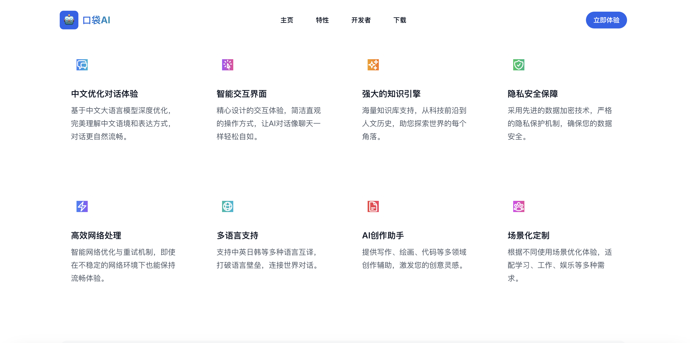
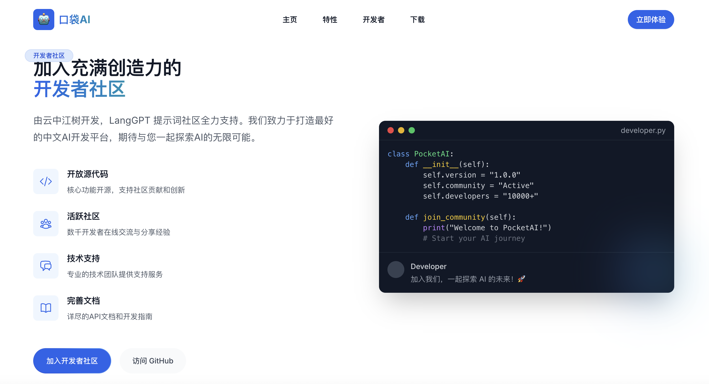

# 🌌 Aurora Landing

<div align="center">

[](https://nextjs.org/)
[](https://www.typescriptlang.org/)
[](https://tailwindcss.com/)
[](https://opensource.org/licenses/MIT)

A modern, elegant and animated landing page template built with Next.js 13+, Tailwind CSS, and Framer Motion.

[简体中文](./README.md) · [Demo](https://aurora-landing-woad.vercel.app) · [Issues](https://github.com/langgptai/aurora-landing/issues)

</div>






## ✨ Features

- 📱 Fully Responsive Design
- 🎨 Modern UI/UX Design
- 🌈 Beautiful Gradients & Animations
- ⚡️ Next.js 13+ with App Router
- 🎯 SEO Optimized
- 🔍 TypeScript Type Safety
- 🎭 Framer Motion Animations
- 📦 Component-based Development
- 🎨 Customizable Theme
- 📱 Mobile-First Design
- 🛠️ Easy to Customize and Extend

## 🚀 Quick Start

### Prerequisites

- Node.js 16.8 or later
- npm or yarn or pnpm

### Installation

1. Clone the repository

```bash
git clone https://github.com/langgptai/aurora-landing.git
cd aurora-landing
```

2. Install dependencies

```bash
npm install
# or
yarn install
# or
pnpm install
```

3. Start the development server

```bash
npm run dev
# or
yarn dev
# or
pnpm dev
```

4. Open [http://localhost:3000](http://localhost:3000) in your browser

### Build & Deploy

```bash
npm run build
npm run start
```

## 🎨 Customization

### Theme Customization

Edit `tailwind.config.js` to customize theme colors, fonts, etc:

```javascript
module.exports = {
  theme: {
    extend: {
      colors: {
        primary: {...},
        secondary: {...}
      },
      // Other configurations
    }
  }
}
```

### Content Customization

Main content is located in `src/components/sections`:

- `hero.tsx` - Hero section
- `features.tsx` - Features section
- `developer.tsx` - Developer info
- `download.tsx` - Download section

## 📁 Project Structure

```
aurora-landing/
├── src/
│   ├── app/              # Next.js 13 App Router
│   ├── components/       # React Components
│   │   ├── ui/          # Common UI Components
│   │   ├── layout/      # Layout Components
│   │   └── sections/    # Page Sections
│   └── lib/             # Utilities
├── public/              # Static Assets
├── styles/             # Global Styles
└── package.json
```

## 🛠️ Tech Stack

- [Next.js](https://nextjs.org/) - React Framework
- [React](https://reactjs.org/) - UI Library
- [TypeScript](https://www.typescriptlang.org/) - Type Safety
- [Tailwind CSS](https://tailwindcss.com/) - Styling
- [Framer Motion](https://www.framer.com/motion/) - Animations
- [Lucide Icons](https://lucide.dev/) - Icons
- [shadcn/ui](https://ui.shadcn.com/) - UI Components

## 📄 License

This project is licensed under the [MIT](LICENSE) License.

## 🤝 Contributing

We welcome all contributions, including:

- Bug reports and feature requests
- Documentation improvements
- Code contributions
- Usage experience sharing

## 🙏 Acknowledgments

- [Next.js](https://nextjs.org/)
- [Tailwind CSS](https://tailwindcss.com/)
- [Framer Motion](https://www.framer.com/motion/)
- [shadcn/ui](https://ui.shadcn.com/)

## 📮 Contact

- GitHub: [langgptai](https://github.com/langgptai)
- WeChat: 1796060717
- Email: ethereal_ai@hotmail.com

---

If this project helps you, please consider giving it a star ⭐️!